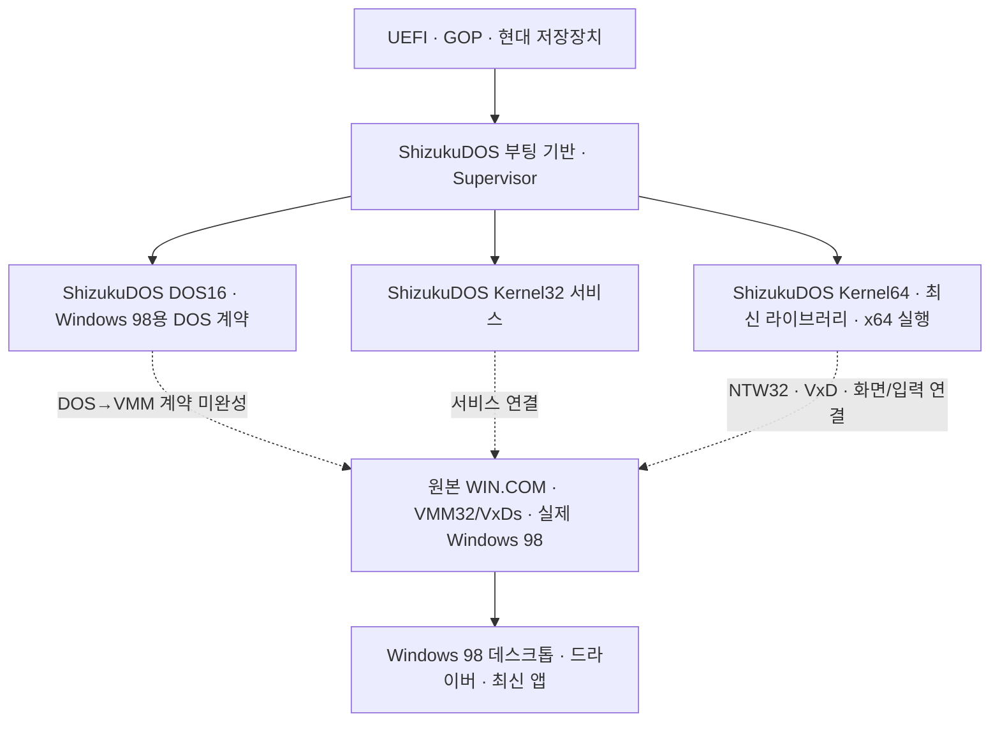

# ShizukuDOS → Windows 98 아키텍처 감사

감사일: 2026-10-01. 읽은 트리: `/root/Win98-Modern-main-integration-20261001`, Git HEAD `466c44105d407ce4677908d5bcdb6481cf85fc9c`. 작업 중인 트리이므로 아래 사실은 읽은 소스와 명시한 문서의 상태를 가리킨다. 이 감사는 저장소 스크립트·빌드·VM을 실행하지 않았으며 기존 소스, Git, 게시본, 원본 Windows 매체를 변경하지 않았다.

## 1. 최종 목표와 구성요소의 역할

**ShizukuDOS는 Windows 98이 사용하는 MS-DOS 기반을 대체한다. Kernel32와 Kernel64는 모두 Windows 98을 위한 ShizukuDOS 구성요소다.** 최종 사용자 환경은 실제 Windows 98의 VMM·Win16/Win32 환경과 데스크톱이며, ShizukuDOS의 자체 데스크톱으로 프로젝트를 끝내지 않는다.

Kernel32는 보호 모드 서비스와 드라이버·호환 계층을 제공하는 구성요소다. Kernel64는 Long Mode에서 최신 라이브러리와 x64 실행 환경을 제공하고 Windows 98 쪽 클라이언트와 연결하는 구성요소다. 현재 Supervisor의 별도 실행 도메인 모델은 이 역할을 수행하기 위한 구현 수단이다. 별도 커널에 진입했다는 사실만으로 Windows 98의 DOS, VMM 또는 앱 실행 경로가 교체·연결되었다고 판단하지 않는다.

`standalone`, `kernel64`, `shz.desktop`, 자체 설치기와 개발 ISO는 구성요소를 실제 CPU·드라이버·디스크 위에서 시험하는 프로필이다. 계속 유지할 수 있지만 제품의 최종 아키텍처와 완료 판정을 대신하지 않는다. 현재 독립 실행 결과와 실제 Windows 98 결과는 각 시험의 실행 경로로 식별한다.

다음 그림은 **구현 목표**다. 점선 연결은 현재 일반 빌드에서 완성되지 않은 연결이다.

## 2. 현재 구현된 경로

| 경로 | 소스에서 확인한 실행 내용 | 이 경로가 입증하는 범위 |
| --- | --- | --- |
| 자체 ShizukuDOS 0.1 | `shizukudos/boot.asm`, `stage2.asm`: FAT12 읽기, 제한된 COM/INT21 인터페이스, `BOOT`/`BOOTC` 체인로드 | 작은 DOS형 셸과 체인로드. 일반 DOS 프로그램·Windows 98 DOS 계약의 완성은 아님 |
| DOS16 외부 소스 프로필 | `shizukudos/dos16/build.py`: FreeDOS ke2046와 FreeCOM 고정 소스 빌드. `make all XCPU=386 XFAT=32`; 시험 이미지는 FAT16과 `KERNEL.SYS`·`COMMAND.COM`으로 구성 | DOS API·COM/EXE·BIOS 적합성 시험을 위한 실제 DOS 기반. Windows 시작 호출은 없음 |
| DOS16 BIOS/UEFI 공통 이미지 | 동일한 디스크를 BIOS MBR 또는 UEFI→CSMWrap→SeaBIOS→MBR 경로로 시작 | DOS16을 UEFI 기계에서 실행하는 펌웨어 연결. Windows 98 VMM 시작과는 별도 |
| 일반 Supervisor | `shizukudos/supervisor/src/main.c`는 DOS16, Kernel32, Kernel64를 생성한 뒤 채널과 스케줄러를 시작 | 구성요소 도메인의 VMX/EPT 실행·통신 기반. 현재 일반 소스에는 Windows 98 도메인 생성 호출이 없음 |
| Kernel32/64 단독 시험 | `kernel32/standalone`, `kernel64/standalone`, `kernel64/main.c`, `tests/run_k64_desktop.py` | 보호 모드/Long Mode, API, GOP·입력·저장장치·자체 GUI·실제 자식 실행 등 구성요소 동작 |
| 기존 Windows CSM/GOP 경로 | `shizukudos/csm/test_win98_uefi.py`, `csm/ios_gop`, `iosys_uefi`는 기존 Windows VBR/IO.SYS 또는 MSLOAD를 이어 실행 | 원본 Windows 98의 UEFI 진입·GOP 연결과 네이티브 Windows 시험. MS-DOS 교체는 입증하지 않음 |
| 설치된 Windows 도메인 후보 | 아래 `CANDIDATE`에 보존된 `native_win98/{win98,ata_pio,string_pio}.c`와 Supervisor 변경본 | 실제 VMCS/EPT·SeaBIOS·ATA·REP PIO·페이지 오류 처리 후보. 일반 빌드에 아직 편입되지 않음 |

`CANDIDATE`는 다음 저장소 상대 경로를 뜻한다.

`docs/shizukudos10/reports/checkpoint-20261001/native-win98-candidate/`

### DOS16에서 확인한 중요한 간극

`dos16/patches/0001-shizukudos-branding.patch`는 FreeDOS의 branding hook에 표시 이름을 추가한다. `0002-reproducible-build-date.patch`와 FreeCOM 패치는 재현 가능한 빌드 표시에 관한 것이다. 이 패치들은 Windows 98의 DOS→VMM 호환 계약을 구현하지 않는다.

`dos16/build.py`의 `AUTOEXEC_BAT`는 `T_MODE`, `T_BIOS`, `T_COM`, `T_EXE`를 실행하고 결과를 기록한 뒤 `SHZEXIT.COM 0`으로 끝난다. `WIN.COM`을 시작하는 코드나 Windows 98 시스템 디렉터리를 선택하는 프로필이 없다. FAT32을 처리할 수 있게 커널을 컴파일하는 것과, 실제 Windows 98 설치 볼륨에서 DOS를 교체하여 Windows를 시작하는 것은 서로 다른 완료 조건이다.

읽은 고정 FreeDOS 소스에는 `WIN31SUPPORT`로 감싼 Windows 3.x 지원 후보가 이미 있다. `kernel/inthndlr.c`의 INT2F `1605h`/`1606h` 초기화·종료와 `1607h/BX=0015h` DOSMGR, `hdr/win.h`와 `kernel/kernel.asm`의 startup/instance/patch 구조를 재사용 후보로 조사해야 한다. 현재 Linux 빌더는 이 옵션을 명시적으로 켜지 않는다. 단순히 옵션을 켜는 것도 Windows 98 지원 완료가 아니다. 해당 코드에는 내부 자료 조회·WinOLDAP MCB 처리 등의 미완성 부분과 DOSMGR 지원 처리의 FIXME가 남아 있다.

FreeDOS의 일반 DOS API 제공 범위는 [FreeDOS kernel 공식 문서](https://kernel.fdos.org/)에 설명되어 있다. Windows 초기화에 필요한 startup 구조·instance 자료·V86 callback은 [RBIL INT2F/1605](https://fd.lod.bz/rbil/interrup/windows/2f1605.html), 종료 처리는 [RBIL INT2F/1606](https://fd.lod.bz/rbil/interrup/windows/2f1606.html)을 참고할 수 있다. 이 공개 계약은 조사 출발점이며, 선택한 Windows 98 SE의 실제 호출·내부 자료 요구를 모두 설명하거나 현재 커널의 호환성을 보증하지 않는다.

### Windows 도메인과 Kernel64 연결의 간극

`supervisor/src/kdom.c`는 channel 2를 `SHZ_DOM_KERNEL64 ↔ SHZ_DOM_WIN98`로 계획한다. 그러나 `alive()`가 두 도메인을 확인해야 채널을 만든다. 일반 `src/main.c`는 Windows 98 도메인을 만들지 않는다. 따라서 현재 일반 Supervisor에서 이름과 번호만 존재하는 channel 2를 실제 Windows 연결로 보고할 수 없다.

`kernel64/subsys64.c:492`의 `subsys64_start()`도 실제 `SHZ_DOM_WIN98` peer를 찾아야 서비스를 연결한다. peer가 없으면 bridge idle을 기록한다. 단독 프로필의 loopback은 Kernel64 내부 시험이며 실제 VMM peer가 아니다.

`CANDIDATE/source/shizukudos/supervisor/native_win98/win98.c`는 Windows 도메인 생성, 128 MiB RAM, 256 KiB 실제 SeaBIOS ROM, 2 GiB 소유 디스크, primary ATA/IRQ14 및 bounded REP I/O를 구현한 후보다. `CANDIDATE/manifest.json`은 source/host/native-link 검증과 실제 설치된 Windows 부팅 미검증을 구별한다. `peer-dispatch-source`도 보존 후보이며 실제 VM 실행과 standalone 컴파일을 완료로 표시하지 않는다.

후보를 그대로 채택하면 SeaBIOS가 **현재 설치된 디스크의 원래 DOS 부팅 경로**를 실행한다. 이는 Windows 도메인·채널의 제어군을 만들 수 있지만 MS-DOS 대체의 최종 구현은 아니다. 또한 `native_win98/build_candidate.py`는 역사적 비공개 빌드 영수증·COMPILE 경로·디스크 pin과 준비 예산에 의존한다. 클론 직후 사용할 일반 빌더로 간주하거나 기존 소스 위에 일괄 덮어쓰면 안 된다. 보존 자료는 그대로 두고 유지 가능한 opt-in 소스로 편입해야 한다.

Windows 쪽은 `ntwrapper/vxd/native.c`, `bridge.c`, `control.asm`, `ntwin32/win64`에 실제 VMM callback, guarded CPUID/VMCALL, 공유 채널, 프로세스·콘솔 프로토콜이 존재한다. 최근 `reports/MODERN_APPS_CAMPAIGN.md`는 네이티브 VxD load/query 및 없는 x64 서비스의 거절 시험을 기록한다. 오래된 문서의 VxD 로드 실패를 현재 전체 상태로 반복하면 안 된다. 반대로 이 최신 negative gate도 실제 Supervisor peer를 통해 x64 앱을 시작한 positive gate는 아니다. 현재 콘솔 프로토콜만으로 최신 앱의 GUI·입력·오디오·Windows 98 창 수명까지 연결되었다고 주장할 수 없다.

### 원본 IO.SYS 진입 실험의 위치

`iosys_uefi/README.md`의 최신 기록은 원본 IO.SYS entry와 GOP 소비를 확인하고, 후속 실제 Windows 98 desktop/Notepad/Save As 및 framebuffer 비교를 기록한다. 엄격한 새 파일 저장·읽기 검증 실패는 별도로 보존되어 있다. 더 이른 `csm/ios_gop/VALIDATION.md`의 USER.EXE 실패만 인용해 이후 Windows GUI 증거를 지우면 안 된다.

이 경로는 원본 DOS 제어군과 펌웨어·GOP ABI 조사에 유용하다. ShizukuDOS가 DOS를 대체한 결과로 분류하려면 원본 MSLOAD/DOS 커널을 이어 실행하는 연결을 실제 ShizukuDOS 연결로 바꾸고 새 완료 증거를 남겨야 한다.

## 3. 남은 DOS→VMM 계약

다음 항목은 **구현·측정해야 할 계약 목록**이다. 공개 일반 DOS/Windows 인터페이스에서 출발하되 정확한 호출 순서와 내부 자료 layout은 선택한 Windows 98 SE의 원본 DOS 제어군과 ShizukuDOS 후보를 비교해 확정한다. 현재 소스만으로 모든 항목의 정확한 Win98 layout을 안다고 가정하지 않는다.

| 계약 | 현재 재사용할 기반 | 추가해야 할 내용과 성공 기준 |
| --- | --- | --- |
| Windows 볼륨과 시작 설정 | FreeDOS FAT12/16/32·EXEC·FreeCOM, 현재 FAT/partition 코드 | Windows 디렉터리·SYSTEM.INI·WIN.COM 식별, CONFIG/AUTOEXEC 처리와 시작 정책. 소유 FAT32 볼륨에서 실제 WIN.COM 적재·실행 |
| DOS 프로세스·상주 자료 | FreeDOS PSP, MCB, SFT/CDS, InDOS/SDA 관련 구조 | Windows가 읽는 자료와 reentrancy/critical-error/driver chain 계약을 명세하고 포인터·수명·경계·반환값 검증. 필요한 DOS 7.1 확장은 실제 호출 근거로 구현 |
| Windows 초기화·DOSMGR | FreeDOS의 선택적 Win3.x hook, RBIL 계약 | startup/instance chain, INT2F 초기화·종료·DOSMGR와 필요한 INT2A critical section. 미구현 요청을 지원한 것으로 반환하지 않음 |
| 메모리·모드 전환 | Supervisor EPT·VMCS, A20/PIC, 후보의 386 page translation | XMS/UMB 및 V86/PM 전환 요구 조사. WIN.COM→VMM 구간에서 GDT/IDT/CR0/CR3/CR4와 IRQ·예외 처리가 실제로 이어짐. Windows RAM과 DOS 상주 상태를 보존 |
| Windows의 디스크 경로 | ATA 후보, AHCI/NVMe 구성요소, FAT32 | real-mode 디스크 접근과 VMM 이후 보호 모드 저장장치 경로를 연결. 호스트가 실제 저장 결과를 읽어 대조하고 flush까지 검증 |
| native GOP 표시와 입력 | 기존 Shizuku GOP 드라이버, CSM early text, PCI/xHCI/PS2 구성요소 | 실제 Windows 98 display/GDI 경로에서 GOP framebuffer를 사용. 키 입력·창 그리기·mode/pitch/format·재부팅 후 readback을 실제 Windows에서 검증 |
| Windows↔Kernel32/64 서비스 | `shz_abi`, `shz_ipc`, NTW32/VxD, Kernel64 subsystem | 살아 있는 Windows domain과 channel2 생성·매핑·doorbell·수명·권한. Windows 프로세스가 요청한 실제 x64 프로세스 시작·종료·파일·GUI·입력 왕복 |

Windows VMM의 DOS 호출을 Kernel32/64의 이름이나 NT API export 목록으로 충족한 것으로 판단하지 않는다. DOS/VMM 부팅 ABI, Windows VxD 통신 ABI, 최신 Win32/Win64 앱 API는 서로 다른 실제 연결이다.

## 4. 구체적인 다음 구현 순서

아래 파일 중 새 디렉터리 이름은 **제안**이며 현재 구현이 존재한다는 뜻이 아니다. 각 단계는 이전 단계의 실패를 숨기지 않는 독립 결과와 불변 입력 hash를 남긴다.

1. **공통 목표·프로필 표기를 먼저 고정한다.** `README.md`, `shizukudos/README.md`, `docs/DESKTOP_BOOT.md`, `docs/shizukudos10/{MEDIA,RELEASE,WIN64_SUBSYSTEM}.md`, ISO 생성 문구와 KO/EN 사이트가 Windows 98용 MS-DOS 대체를 최종 목표로 표시하게 한다. `component-test`, `original-dos-control`, `win98-dos-replacement`의 실행 종류를 영수증에서 구분하고 기존 완료 결과를 바꾸지 않는다.

2. **기존 native 후보를 유지 가능한 opt-in source로 편입한다.** `CANDIDATE/source`와 `peer-dispatch-source`를 검토해 `shizukudos/supervisor/native_win98/` 및 작은 일반 loader/domain/device 연결로 이식한다. 역사적 receipts와 private disk 상수에 묶인 builder를 복사 실행하지 않는다. 새로운 빌더는 명시적으로 전달받은 owned disk/ROM/config와 일반 source-bound 빌드 입력을 사용한다. 기존 default 및 원본 DOS 제어군은 유지하며, actual Windows 도메인 부팅·IRQ·ATA·VMM 채널을 먼저 측정한다. 이 단계의 성공은 DOS 교체 완료가 아닌 Windows backplane 연결 결과다.

3. **DOS→VMM 관찰·회귀 계약을 만든다.** 제안 경로 `shizukudos/win98_boot/{contracts,tests}/`에 DOS version/PSP/MCB/파일·메모리/INT2F startup·DOSMGR 요청을 다루는 원래 작성한 COM/host 계약과 구조 명세를 둔다. 원본 DOS와 ShizukuDOS의 호출·레지스터·상주 자료·거절 동작을 같은 선택된 Win98 버전에서 비교한다. 일반 API 이름이나 version 반환만 바꿔 통과한 것으로 처리하지 않는다. 공개 자료에는 원본 Windows 실행 파일·부팅 코드·비공개 메모리 덤프를 넣지 않는다.

4. **FreeDOS 파생 ShizukuDOS의 Windows 시작 프로필을 구현한다.** 제안 패치 `dos16/patches/0003-win98-boot-contract.patch`부터 실제 발견된 계약을 기능 단위로 추가한다. `WIN31SUPPORT`의 기존 구조와 DOSMGR 지원이 필요한 부분은 고쳐 사용하되, Win98에서 실제 요구되지 않은 동작은 임의로 성공 처리하지 않는다. `dos16/build.py`에 conformance와 별도 `win98-dos` 프로필을 두고, 새 프로필은 테스트 후 종료하는 AUTOEXEC 대신 소유 Windows 볼륨의 WIN.COM을 시작한다. 부트 섹터가 실제 새 KERNEL.SYS로 들어가고 원본 Microsoft DOS kernel/MSLOAD를 실행하지 않았다는 코드/입력 hash와 실제 진입 증거를 남긴다. 동일 Windows 파일·동일 guest RAM에서 VMM32/VxD 시작까지 이어져야 한다.

5. **실제 Windows 98 GUI·GOP·저장장치 완료 게이트를 통과한다.** 두 cold boots에서 ShizukuDOS 진입, WIN.COM→VMM→실제 Windows desktop, native GOP 드라이버, 실제 키 입력, 파일 생성·저장·다시 열기와 독립 disk readback을 검증한다. 기존 K64 자체 GUI의 통과를 이 단계에 합산하지 않는다. VMM으로 넘어간 뒤에도 DOS resident 상태, timer/IRQ, disk 쓰기·flush가 올바르게 유지되는지 확인한다.

6. **Windows가 Kernel32/64 서비스를 실제 사용하게 한다.** 살아 있는 Windows domain에서 실제 VxD→VMCALL→channel2→Kernel64 process 생성과 종료를 먼저 통과시킨다. 이후 ABI capability를 협상하는 window/framebuffer·input·audio·file 교환을 추가하고 native Windows 창 수명과 연결한다. 현재 공유 콘솔이나 Kernel64 loopback을 GUI bridge로 간주하지 않는다. Chromium·Legcord·Office·Steam은 이 연결 위에서 원본 실행·실제 기능을 각각 검증한다.

7. **초기 목표의 전체 회귀를 유지한다.** 아래 최종 행렬을 통과하기 전 개발 ISO를 Windows 98 교체/설치 완료 제품으로 표시하지 않는다. public source clone/build와 Microsoft 원본을 별도로 공급받는 private 설치 경로를 함께 제공한다. disk 최적화는 기존 원본·실패 증거를 보존하면서 owned clone·COW·크기 제한·공유 build cache를 사용한다.

## 5. 문구를 수정해야 할 정확한 위치

읽은 소스에서 목표 오해를 만드는 `does not replace IO.SYS` 계열은 주석뿐 아니라 **ISO 안에 생성되는 사용자 안내**에 존재한다.

| 위치 | 현재 의미 | 필요한 수정 |
| --- | --- | --- |
| `tools/build_shizuku_se_iso.py:170`, `edition_text()` | ShizukuDOS 전체가 IO.SYS를 대체하지 않는다는 무기한 표현 | 프로젝트 목표를 명시하고 **이 0.1 시험 이미지의 현재 한계**로 한정 |
| 같은 파일 `:191`, `limits_text()` | 어느 프로필도 IO.SYS를 대체하지 않는다는 표현 | 현재 component profiles의 미완성 상태이며 Win98 DOS 대체 구현이 후속 필수임을 명시 |
| 같은 파일 `:584`, 생성 ShizukuDOS10 안내 | 이 profile의 IO.SYS/GUI 미완성 | 현재 사실은 유지하고 profile이 Windows98용 구성요소 시험이라는 역할을 덧붙임 |
| 같은 파일 `:981`, 배포 루트 안내 | `cannot replace IO.SYS`를 프로젝트 전체 능력의 영구 제한처럼 표시 | `This development build has not yet replaced the Windows 98 DOS boot/runtime. The target is ShizukuDOS booting actual Windows 98.`처럼 현재 상태와 최종 목표를 함께 표시 |
| `shizukudos/README.md` 범위와 한계 | 0.1의 제한은 정확하지만 10.x/K32/K64 구성 목표가 드러나지 않음 | 제목/도입을 0.1 시험 프로필로 유지하고 Windows98 DOS 대체 목표 및 최신 구성 문서로 연결 |
| `supervisor/loader/loader.c:12-17`, `bootini.c`, `docs/DESKTOP_BOOT.md` | `mode=kernel64`가 개발의 기본 경로이며 Windows 연결 설명이 분리됨 | 내부 boot mode 이름은 유지하되 역할을 Windows98용 구성요소 시험으로 설명; future replacement mode와 완료 증거를 별도 정의 |
| `docs/shizukudos10/{MEDIA,RELEASE}.md`의 단독 Kernel64 및 설치기 설명 | 시험 기능과 제품 완료 상태가 섞일 수 있음 | 구성요소 설치·시험인지 실제 Windows98 DOS 교체/설치인지 다운로드별 scope를 명시 |
| `docs/shizukudos10/WIN64_SUBSYSTEM.md:126-139` | 오래된 환경/VxD 실패를 현재 전체 차단 상태로 읽을 수 있음 | 역사적 결과는 보존하고 최신 negative gate와 아직 없는 positive peer/GUI gate를 별도 현재 상태로 갱신 |

Kernel64 source의 `standalone` 이름, 합법적인 원본 IO.SYS 제어군 코드, frozen historical receipt는 의미를 바꾸거나 삭제할 대상이 아니다. 프로필 이름을 바꾸는 것만으로 DOS→VMM ABI가 구현되지도 않는다. 이 감사는 위 기존 파일을 수정하지 않았다.

## 6. 빠뜨릴 수 없는 최종 완료 행렬

| 사용자 목표 | 완료를 판단할 실제 증거 |
| --- | --- |
| ShizukuDOS의 MS-DOS 대체 | compiled ShizukuDOS DOS kernel에서 시작해 원본 Microsoft DOS kernel을 실행하지 않고 WIN.COM→VMM→Windows desktop까지 도달 |
| UEFI GOP로 Windows 98 자체 부팅 | 실제 Windows98 GOP display/GDI·입력·framebuffer 검증. 자체 Shizuku GUI나 원본 DOS 제어군은 개별 증거로 유지 |
| Kernel32/64 지원 | Windows98 프로세스가 연결된 서비스를 실제 호출하며 peer/channel/수명/오류 처리가 검증됨 |
| 가속·현대 드라이버 | CPU 가상화 가속과 GPU 렌더링 가속을 각각 측정. AHCI/NVMe/USB/PCI-E 동작을 실제 Windows 경로에서 검증 |
| 멀티코어·PAE/전체 RAM | 구성요소 SMP/PAE 프로브를 넘어 Windows98 사용 경로에서 기능·주소 범위·보존·안정성 확인 |
| Chromium | Windows98 창/입력과 연결된 실제 브라우저 페이지·JavaScript·네트워크·멀티프로세스 기능 |
| Legcord/Discord | 실제 setup 완료와 Discord UI·연결·필수 기능. Electron 창 한 장만으로 완료 판정하지 않음 |
| 최신 오픈소스 Office | 실제 문서 열기·편집·저장·다시 열기와 bytes/content 확인 |
| Steam | 실제 updater·CEF/UI·사용 세션·library와 선택한 game 실행. 다운로드 또는 버전 문자열은 부분 결과 |
| 경량 오류/Dead Screen | Windows/Shizuku 커널 경로에서 경량 오류창·심각한 traceback, `오류!!!!`/`Halted!!!!`, Tetris/수박 게임 및 `You session got wasted` fallback을 실제 오류 시험과 구분해 확인 |
| 배포·미리보기·다른 환경 | nginx의 m98 KO/EN 다운로드와 미리보기, 정확한 source/artifact checksum, fresh clone/source build, 각 다운로드의 검증 scope |
| 디스크 최적화 | owned 출력의 예산·COW/회수 정책 검증과 원본/현재 VM/실패 증거 보존 |

**현재 audit 판정: Windows 98을 위한 여러 구성요소와 원본 DOS 기반 Windows 경로는 존재한다. ShizukuDOS DOS kernel에서 실제 Windows 98 VMM으로 이어지는 대체 경로와 그 위의 전체 서비스·최신 앱 완료 판정은 아직 남아 있다.** 이 판정은 완료 목표를 낮추지 않는다.

## 7. 감사에 사용한 주요 소스

- `shizukudos/dos16/build.py`, 세 `dos16/patches`, `dos16/tests`, `shizukudos/upstream/manifest.json`.
- FreeDOS pin `5ffb5502d39a10a30f5b8a9e8beeba0bf30245d3`의 cached `kernel/inthndlr.c`, `kernel/entry.asm`, `kernel/kernel.asm`, `hdr/win.h`, `build.bat`. 일반 문서 출처: [고정 FDOS kernel 소스](https://github.com/FDOS/kernel/tree/5ffb5502d39a10a30f5b8a9e8beeba0bf30245d3).
- `shizukudos/supervisor/{loader/loader.c,src/main.c,src/dos.c,src/kdom.c,src/domain.c}` 및 `kernel32/main.c`, `kernel64/{main.c,subsys64.c}`.
- `CANDIDATE/manifest.json`, 보존 `source/`와 `peer-dispatch-source/`. 이 후보의 현재 status는 `SOURCE_CANDIDATES_HOST_AND_NATIVE_LINK_VALIDATED_ACTUAL_INSTALLED_WIN98_BOOT_PENDING`다.
- `shizukudos/csm/test_win98_uefi.py`, `csm/ios_gop/VALIDATION.md`, `iosys_uefi/{README.md,prepare.py,boot.py}`.
- `ntwrapper/vxd/{native.c,bridge.c}`, `ntwin32/win64`, `docs/shizukudos10/{BASELINE,WIN64_SUBSYSTEM}.md`, `reports/MODERN_APPS_CAMPAIGN.md`, `docs/DESKTOP_BOOT.md`, `README.md`, `tools/build_shizuku_se_iso.py`.

기존 기록의 PASS 수치를 이 감사에서 다시 실행한 결과로 제시하지 않는다. 실제 구현 실행과 Windows 매체 변경은 이 감사의 범위 밖이다.
