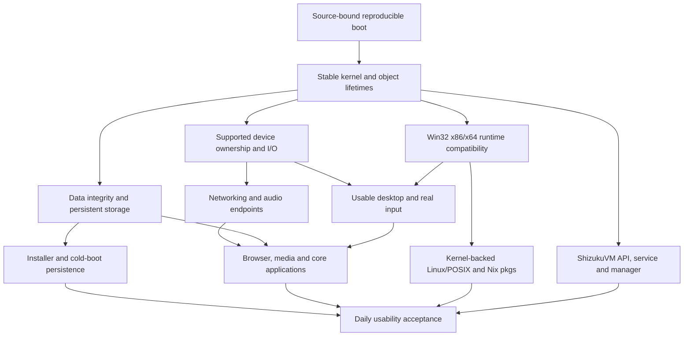

# ShizukuOS implementation dependency map — 7abd

The current user objective is a usable Windows-compatible ShizukuOS, with
stability, compatibility and integration ahead of feature count. This map
records repository findings and execution order; it does not declare product
acceptance. Existing directory layout, kernel layers, boot profiles and ABI
remain the implementation foundation.

## Repository classification

| Requirement | Classification | Existing foundation and remaining work |
| --- | --- | --- |
| Core and boot | EXISTS / PARTIAL / REUSABLE | `shizukudos/supervisor/src/core.*`, `dos16/`, `kernel32/`, `kernel64/`, BIOS/UEFI and standalone profiles. Common authority transfer and integrated product boot remain incomplete. |
| Memory, processes, objects and Win32 ABI | EXISTS / PARTIAL / REUSABLE | Kernel32/64 services, `ntwin32/`, `ntwrapper/` and `shizukudos/win64/`. Continue real API and lifetime behavior; complete Windows 10 compatibility is a target. |
| Storage and installation | PARTIAL / REUSABLE | AHCI/NVMe, FAT32, ShizukuFS/ext4 and the existing installer. Default C: is a RAM filesystem; user data and settings need a supported persistent product path and cold-boot verification. |
| Hardware | PARTIAL / REUSABLE | Existing PCI, ACPI, laptop, USB/xHCI/HID, GOP/framebuffer and virtio implementations. Qualify actual resources, transfers, input and teardown for a declared device matrix. |
| Desktop and themes | PARTIAL / REUSABLE | Existing SHZDESK, USER/GDI and native theme work. The other Claude shell-port lane owns the Korean desktop/frontend. Slade, Flute and Jade system-wide themes from the objective remain acceptance requirements. |
| Networking and browser | PARTIAL / REUSABLE | Existing network stack, Win64 networking APIs and Zetscape/WebKit code. Terrasphere is not yet an integrated product; verify real supported web browsing on the shipped path. |
| Sound | MISSING product event routing / REUSABLE legacy path | The requested NAS WAV folder is reachable. Existing Windows 98 waveOut probes are a reference; x64 winmm still reports unavailable devices and has no complete product sound backend/event scheme. NAS assets alone are not sound support. |
| Core apps | MISSING named product integration / REUSABLE runtime and app code | Existing shell/file/process code and elevated-child utility are foundations. Muzik, Sapphire and Folio integration, document/image/media workflows and standard utilities need implementation and execution. |
| Linux environment | MISSING | No implemented ShizukuLB, SHZLB.sys, Nix-synchronized pkgs or kernel-backed chkrnl modes found. Reuse current kernel services only after ownership and syscall contracts are explicit. |
| ShizukuVM | MISSING product API/manager / REUSABLE VM foundation | Existing Supervisor VMX/EPT/domain machinery is a technical foundation; it is not the requested VM service, API and manager. Evaluate QEMU reuse before creating new implementations. |

## Dependency graph

## First independent stability milestone

Two actual local Claude Code CLI sessions work in an isolated Git worktree.
The filesystem worker uses the installed `opus` alias/high effort for capacity
overflow and backend failure handling. The build worker uses `sonnet`/medium
for the existing isolated standalone source lists and input closure. Installed
CLI results resolve the aliases to their actual provided models; model names
are not substitutes for review or execution.

The production edit boundaries are `kernel64/fs.c`, `kernel64/sysfile.c`,
`tools/build_isolated_kernel.py` and `tests/run_k64_smp_boot.py`, plus focused
file-error tests. Current public kernel inputs are frozen separately from our
edits. Other sessions' snapshot changes are not ours to commit or merge.

Root consumes worker reports, reviews errors and ownership behavior, runs the
relevant production-code host tests, and then serially builds and boots the
final public source cohort. Independent AP boot tests prove the tested kernel
component; they do not prove a desktop, Windows 98 integration, applications,
an installer, Linux support, sound or whole-OS usability.

## Next acceptance milestones

1. Integrate reviewed stability patches with the current source owner, retaining
   original failed and successful verification records.
2. Validate the latest Korean shell in its actual boot/runtime path with real
   keyboard and pointer input, file navigation, application launch and cleanup.
3. Connect supported persistent storage to installer and user workflows;
   verify saved files, accounts and settings survive a cold boot.
4. Qualify device transfers, networking and real audio, then wire all required
   sound events and themes. Preserve asset provenance before distribution.
5. Run supported Windows application workflows and integrate core apps before
   extending Linux and VM product services. Keep unsupported operations
   truthful and preserve the retained compatibility regression paths.

Source/build/boot results are recorded in this worktree's
`build/autopilot-7abd/` and `.codex/task-state.md`. Public development source is
separate from private Microsoft media and guest images; ISO distribution keeps
the existing project boundary.
