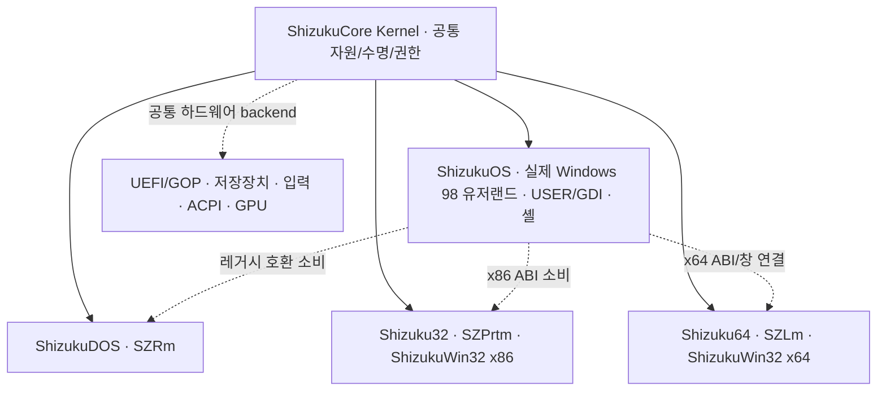

# ShizukuCore Kernel · ShizukuWin32 단계별 전환 계약

2026-10-03 최신 사용자 지시를 적용한다. 이 문서는 설계·전환 계약이며,
새 커널이나 Windows 호환성의 구현 완료 영수증이 아니다.
최신 아키텍처 결정을 구체화하는 단계별 보충 문서다.
구현 출발점, 권한 이전과 실제 검증 조건을 함께 기록한다.

## 최신 지시와 과거 문서의 우선순위

사용자의 앞선 두 메시지와 최신 계층 지시를 그대로 보존한다.

> Win98, DOS의 한계를 넘어야 한다. MS-DOS FreeDOS 커널 수준도 아닌 Shizuku Kernel 수준으로 발전시키고 그 커널은 ReactOS와 비슷한 포지션, ReactOS를 참고해서 만들어라. Wine도 참고 가능하다. 유저랜드만 Windows 98이면 될거다. 커널까지 98이라는 말은 한 적 없음. 다만 급진적이 아닌 점진적인 구조 변화와, 코드 전환 과정이 필요할 뿐.

> Windows 98의 형상을 하고 98의 코드를 쓴 사실상 Shizuku Kernel + Shizuku Win32 +Shizuku Win32(x64) 등으로 혼합된 OS

> ShizukuDOS 또한 ShizukuCore Kernel의 하위 요소로 두어야 한다. ShizukuCore --> === ->ShizukuDOS(SZRm) ->Shizuku32(SZPrtm) ->Shizuku64(SZLm) ->ShizukuOS(Windows 98)

현재 방향은 **실제 Windows 98 유저랜드·코드를 유지하면서 현대
ShizukuCore Kernel과 ShizukuWin32 x86/x64로 점진적으로 전환하는 혼합 OS**다.
기존 23개 원칙과 과거 아키텍처·실험 기록은 원문 그대로 보존한다.
그중 원본 Windows 98 VMM을 영구적인 유일 커널·스케줄러로 고정하거나,
새 커널을 금지하거나, MS-DOS/FreeDOS 교체를 최종 기능 상한으로 삼는
조건은 최신 지시로 대체되었다. 과거 PASS의 실행 경로나 범위는 바꾸지 않는다.

원본 DOS/VMM은 전환용 호스트·어댑터 또는 선택 가능한 레거시 호환 경로가
될 수 있다. Windows 98처럼 보이는 자체 화면만으로 실제 Windows 98
유저랜드 실행을 입증할 수는 없다. 실제 사용자 코드, 실행된 바이너리,
API 제공자와 책임 커널을 함께 식별해야 한다.

## 최상위 Core와 네 하위 요소

ShizukuCore Kernel이 최상위 공통 커널이며, 아래 네 요소는 그 아래에 있다.
ShizukuDOS는 Core의 부모나 최종 커널의 기능 상한이 아니다. 하위 요소들이
각기 별도의 커널 권한으로 같은 CPU·메모리·장치를 소유한다는 뜻도 아니다.

| 사용자 지정 하위 요소 | 역할과 현재 구현을 연결할 지점 |
| --- | --- |
| ShizukuDOS (`SZRm`) | Core 아래의 DOS/레거시 호환 요소. 기존 DOS16·부팅·DOS 계약 소스는 출발점이며 Core 구현 전체와 동일하지 않다. |
| Shizuku32 (`SZPrtm`) | 32비트 실행·서비스 요소. 기존 `shizukudos/kernel32/`와 x86 호환 코드의 역할을 재정의하며 ShizukuWin32 x86 ABI와 연결한다. Microsoft `KERNEL32.DLL`과 구분한다. |
| Shizuku64 (`SZLm`) | 64비트 실행·서비스 요소. 기존 `shizukudos/kernel64/`의 로더·서비스·작업 기반을 ShizukuWin32 x64 ABI와 연결한다. |
| ShizukuOS (`Windows 98`) | 실제 Windows 98 유저랜드·코드, USER/GDI와 클래식/현대 셸을 제공하는 사용자 환경. x86/x64 서비스를 소비하며 Core의 공통 자원 권한을 따른다. |

제품 전체의 이름 ShizukuOS와 하위 구성 ShizukuOS(Windows 98)는 사용자가
지정한 같은 이름을 사용한다. 하위 구성은 기존 유저랜드·시스템 코드를
담는 요소이며 전체 제품이나 별도의 최상위 커널로 해석하지 않는다.

`SZRm`·`SZPrtm`·`SZLm`은 사용자가 지정한 식별자다. 이름만으로 단순
Real/Protected/Long CPU 모드, 독립 커널, 특권 수준 또는 격리 보장을
확정하지 않는다. 실제 실행 모드·프로세스·주소 공간·호출 ABI·하위 요소에
위임된 책임을 부팅 프로필과 영수증에 각각 명시한다. Core가 공통 자원의
권한과 수명을 관리하고, 하위 요소는 명시된 범위에서만 실행·서비스 책임을
위임받는다. ShizukuWin32 x86/x64는 해당 실행 요소가 제공하는 호환 ABI이며
사용자 지정 네 요소를 조용히 다른 계층으로 대체하는 이름이 아니다.

## 현재 소스에서 확인한 출발점

읽은 초기 체크아웃은 `3f7efdab8ce463d0b6da20fc4cda2ab688ce1908`이다.
아래는 소스 경로의 존재·동작을 읽은 결과이며 새 VM 검증 결과가 아니다.

| 현재 경로 | 확인한 책임과 제한 |
| --- | --- |
| `shizukudos/supervisor/src/main.c` | VMX 초기화 후 명시적인 native-Win98 플래그에 따라 Windows 도메인 또는 DOS16 도메인을 생성하고 Kernel32/64·채널·도메인 스케줄러를 시작한다. 조건부 생성 코드는 실제 Windows 부팅 성공 증거와 별개다. |
| `shizukudos/kernel64/{main.c,sched.c,ldr.c}` | CPU·메모리·스케줄러 초기화, 기존 BSP 중심 실행과 별도 AP 작업 기반, AMD64 PE32+ 프로세스 로더가 있다. 기존 주석의 VMM 영구 권한 표현은 과거 계약이며, 이 문서가 일반 SMP·완전한 NT 커널 구현을 선언하지 않는다. |
| `shizukudos/kernel64/subsys64.c` | 실제 WIN98 peer 채널을 찾는 서비스를 갖고, peer가 없으면 bridge idle을 기록한다. standalone loopback은 내부 구성요소 시험이다. |
| `ntwin32/win64/ntw64.c`, `ntwrapper/vxd/` | Win98 쪽 Win64 요청·대기·콘솔·수명 연결의 출발점이다. 콘솔 연결이 완성된 GUI·입력·오디오·앱 호환성을 뜻하지 않는다. |
| `ntwin32/{exception,tls,loader}/` | 고정 ReactOS 소스를 참조한 작은 호환 구성요소와 파일별 출처가 있다. 이를 완전한 Windows 98/NT 실행 환경으로 확대 해석하지 않는다. |

현행 독립 커널, 기존 DOS 기반 Windows 대조군, native 도메인 후보는
서로 다른 실행 경로다. 새 이름으로 기존 증거를 합쳐 완료 판정을 만들지 않는다.
기존 Supervisor/Kernel32/Kernel64를 Core/SZPrtm/SZLm에 어떻게 통합할지는
명시적인 전환 작업이다. 소스 디렉터리의 이름이나 이 표의 대응만으로
최상위 Core 통합 또는 네 요소의 실제 연결이 이미 완료되었다고 하지 않는다.

## ADR-HYBRID-01: 단계별 권한 이전

**상태:** 사용자 방향은 확정, 아래 단계의 구현·승격은 실제 증거를 기다린다.
**맥락:** 기존 Win16/Win32 프로그램과 Windows 98 사용자 경험을 보존하면서
현대 메모리·드라이버·보안·x64 실행 능력을 확보해야 한다.
**결정:** 실행 프로필마다 책임을 명시하고, 기능을 작은 단위로 이전한다.
**대안:** DOS 교체만으로 끝내는 설계는 최신 목표를 충족하지 않는다.
전체 유저랜드를 한 번에 교체하면 회귀 원인과 ABI 변화를 분리하기 어렵다.
**결과:** 재현 가능한 전환과 이전 버전 비교가 가능하지만, 일정 기간에는
레거시 경로와 새 서비스의 수명·오류·저장 형식을 함께 관리해야 한다.

| 단계 | 실제 사용자 코드와 실행 환경 | 스케줄링·메모리·장치 권한 | 승격에 필요한 증거 |
| --- | --- | --- | --- |
| 0 — 기존 경로와 전환 기준선 | 원본 DOS/VMM 기반 Win98 유저랜드 및 별도 Shizuku 구성요소. 각 결과를 대조군·구성요소로 식별한다. | VMM은 해당 레거시 Windows 실행 환경의 스레드·주소 공간을 관리한다. Supervisor와 Kernel32/64는 각자의 실행 도메인·작업을 관리한다. | 실제 실행 바이너리·원본 부팅 의존성·제한을 기록한다. 이 단계만으로 현대 ShizukuCore Kernel 전환 완료를 주장하지 않는다. |
| 1 — Core 호스트와 레거시 Windows 연결 | 실제 Win98 유저랜드·USER/GDI/Explorer를 Core 아래의 호환 도메인에서 실행하고 Shizuku32/64 서비스를 연결한다. ShizukuDOS와 레거시 VMM 의존성은 공개한다. | 목표 ShizukuCore Kernel/호스트는 CPU·메모리·IRQ·장치의 최상위 소유자다. VMM은 위임받은 레거시 도메인 안에서만 스레드와 게스트 주소 공간을 관리한다. 두 계층의 중첩 관계를 명시한다. | 실제 Win98 화면·입력·파일 작업, 양방향 서비스 호출, 대기/완료/종료, 실패한 peer의 회수와 설치 디스크 재부팅을 동일 실행에서 관측한다. |
| 2 — ShizukuWin32 x86/x64로 선택적 이전 | 선택한 실제 x86 프로그램은 Shizuku32의 새 x86 ABI/로더/서비스를 사용하고, 실제 x64 바이너리는 Shizuku64의 Long Mode 실행 환경을 사용한다. 남은 Win16/Win9x 경로는 Core 아래의 어댑터로 유지한다. | 이전된 프로세스·스레드·주소 공간·토큰·객체·I/O의 공통 권한은 ShizukuCore Kernel이 관리한다. 하위 요소는 명시된 책임을 위임받는다. VMM은 아직 이전되지 않은 레거시 실행만 관리하며, 동일 객체나 스레드에 중복 권한을 갖지 않는다. | 기능별 이전 목록과 실제 import/API 제공자, 프로세스 실행·오류·취소·보안·데이터 영속성, 32/64 경계와 실제 Windows UI 연결을 검증한다. |
| 3 — 현대 혼합 OS | ShizukuCore Kernel 아래 ShizukuDOS·Shizuku32·Shizuku64·ShizukuOS가 통합된 주 실행 기반이다. ShizukuWin32 x86/x64와 실제 Windows 98 유저랜드·코드를 유지하며 코드를 점진적으로 대체한다. | Core가 기본 스케줄링·VM·장치·보안 권한을 가진다. DOS 호환과 레거시 VMM 실행은 Core 아래에서 필요할 때 명시적으로 선택하며 최종 커널의 기능 상한이 아니다. | 전체 목표의 실제 기능·성능·보안·복구를 검증한다. 레거시 의존성을 제거한 기능은 제거된 경로가 실제로 사용되지 않는다는 증거도 남긴다. |

각 단계는 목표다. 특히 1단계의 최상위 호스트 권한과 2단계의 사용자
프로세스 이전은 현행 소스가 이미 모두 구현했다는 주장이 아니다.
현행 최상위 호스트와 목표 Core가 아직 별개라면 부팅 프로필에 둘을 각각
적고, 그 미완료 통합을 숨기지 않는다.
모든 릴리스는 자신이 검증한 단계와 남은 레거시 의존성을 표시한다.

Core의 네 실선 분기는 논리적 하위 관계이며 실제 부팅 순서가 아니다.
하드웨어는 공통 backend이며 다섯 번째 제품 하위 요소가 아니다.
이 그림은 전환 목표이며 현재 연결 완료 상태를 그린 것이 아니다.

## 경계별 구현 계약

- **스케줄링·메모리:** 각 프로세스·스레드·주소 공간·IRQ·장치에는 하나의
  책임 소유자가 있어야 한다. 중첩 실행에서는 호스트 CPU 스케줄링과 게스트
  스레드 스케줄링을 구분한다. 같은 스레드를 두 실행 큐에 넣거나 페이지의
  보호·회수 권한을 조용히 공유하지 않는다. 이전 시 실행을 멈추고 기존
  요청·매핑·DMA를 정리한 뒤 새 소유자와 세대를 공개한다.
- **Win16/Win32/x64 ABI:** 실제 PE32/PE32+ 바이너리를 실행한다. Win98이
  PE32+를 직접 로드한다고 설명하지 않는다. 포인터 폭, 호출 규약, UTF,
  TLS·예외·핸들·취소·프로세스 종료를 정의한다. 다른 주소 공간의 포인터나
  핸들을 그대로 넘기지 않고 길이 검증·복사·소유자 확인·세대를 사용한다.
- **USER/GDI와 셸:** 실제 Win98 USER/GDI·Explorer 경로를 전환의 출발점으로
  식별한다. 새 USER/GDI 호환 제공자와 현대 셸로 옮길 때 메시지 루프,
  HWND 수명, 창 소유권, 입력·포커스·클립보드·그리기·DPI·접근성의 책임을
  정한다. x64 원격 창이나 렌더링 표면은 실제 사용자 창·프로세스와 연결하고
  종료·재연결·오류를 처리한다. 클래식/현대 스타일과 애니메이션 배경,
  설정·복원을 실제 앱에서 확인한다.
- **보안·계정:** 인증·등록·elevate·토큰·파일/객체 권한은 해당 객체를
  소유하는 커널/서비스에서 집행한다. UI 승인만으로 권한을 만들지 않는다.
  새 커널의 보호 기능이 레거시 공유 주소 공간까지 자동 적용된다고 하지
  않는다. 권한 이전·재시작·핸들 재사용·실패·비밀 지우기를 시험한다.
- **드라이버·파일시스템:** 동일 장치의 IRQ/MMIO/DMA·전원 수명과 I/O 완료의
  소유자를 정한다. 현대 드라이버 계약은 실제 동작하는 범위만 제공하며
  없는 기능은 실패를 반환한다. ShizukuFS의 형식·소유권·내구성·복구와
  설치 저널을 이전해도 기존 데이터와 실패 증거를 보존한다.
- **실패·복구:** peer 종료, timeout, 중복 완료, 취소, 부분 설치, 부팅 실패에
  대한 회수·롤백·진단을 정의한다. 실패한 새 경로에서 대조군으로 돌아간
  결과는 fallback으로 표시하고 새 경로의 PASS로 계산하지 않는다.
  권한 거부나 부작용 뒤 실패를 다른 제공자에 재실행하지 않는다.

## Pre-Beta01과 전체 목표의 판정

Pre-Beta01은 선언한 전환 단계와 지원 부분집합의 실제 배포 시험이다.
첫 검증 대상은 x86_64 UEFI VM이다. 같은 소스·ISO·설치 입력을 묶어
프로젝트 설치기 진입, UEFI 대상 디스크 설치와 쓰기/readback,
ISO를 제거한 설치 디스크 콜드 부팅, 실제 GOP 화면 출력과 설치된 코어
드라이버 식별을 기록한다. 실제 Windows 98 사용자 코드·창·입력·파일
작업이 무엇인지, ShizukuCore Kernel과 네 하위 요소가 무엇을 소유하고
어떤 책임을 위임받는지도 관측한다.

전환 단계에 따라 원본 DOS/VMM 의존성은 있을 수 있으며 반드시 표시한다.
이를 영구적인 필수 구조로 고정하지 않는다. 기존 대조군 부팅만으로
ShizukuCore Kernel 전환 성공을 주장하거나 독립 개발 셸을 Win98 유저랜드
증거로 대체하지 않는다. 최신 phase 계약에 맞춘 판정 기준을 먼저 적고
실제로 실행한 결과를 평가한다. 이 문서는 현재 Pre-Beta 조건을 PASS로
바꾸거나 검증된 ISO를 제공하지 않는다.

[전체 15개 목표](SHIZUKUOS_FULL_GOAL_ACCEPTANCE.md)는 계속 유지한다.
드라이버·노트북 장치, 협업, 계정, elevate, 샌드박스, 셸·배경,
설정·등록·인증, 보안, 코어 격리, 동시 작업, x64 앱, ShizukuFS,
클래식/현대 UI, ISO의 실제 기능을 각각 검증한다. 이전 문서의 영구 VMM
조건은 최신 단계별 권한 계약으로 해석하고, 실제 기능의 완료 조건을
가짜 성공·버전 문자열·호스트 모형·수입 심볼만으로 채우지 않는다.
현대 앱의 실제 편집·저장·브라우징·통신·정상 종료 등 전체 목표는
Pre-Beta 부분집합 발표 뒤에도 남는다. 각 증거에는 실행 경로, 단계,
소스/아티팩트 해시, 기계·도구·드라이버, 입력, 실패와 정리를 기록한다.

## ReactOS/Wine 참조와 배포 경계

ReactOS는 현대 커널·Win32 계약을 설계하고 작은 구성요소를 단계적으로
이식할 때의 1차 소스 참조다. Wine은 사용자 공간 API·로더·GUI 동작과
호환성 설계의 1차 참조다. 공개 함수 이름이 같다는 이유로 구현이나
커널 의존성을 무조건 복사하지 않는다. 대상 ABI·메모리·동기화·I/O와
오류 의미를 먼저 조사하고 필요한 범위를 이식한다.

- 공식 [ReactOS 저장소](https://github.com/reactos/reactos)의 고정
  `cae3c053d47024545c773148185319075eae0202` 및
  `9dc3ca87209fd8ebabd96c8ea95d439c13e7fdf8`를 사용한 기존 기록은
  [예외 출처](../ntwin32/exception/PROVENANCE.md),
  [TLS 출처](../ntwin32/tls/PROVENANCE.md),
  [로더 출처](../ntwin32/loader/PROVENANCE.md)에 있다. 해당 GPL 고지는
  파일별로 적용하며 모든 ReactOS 파일의 라이선스를 하나로 추정하지 않는다.
- 공식 [Wine 개발 저장소](https://gitlab.winehq.org/wine/wine)와 기존
  [고정 Wine 소스](https://github.com/wine-mirror/wine/tree/df15af3652511150490934682202d45af892f887)를
  참조한다. 기존 TLS 비교는 복사하지 않았으며, 다른 Wine 유래 코드의
  LGPL-2.1-or-later 고지와 [라이선스 원문](../licenses/Wine-LGPL-2.1.txt)은
  유지한다. 참조·비교와 실제 파생 구현을 구분한다.
- 새 이식은 공식 원본 URL·커밋·파일 SHA·원문·저작권/라이선스·변경 범위·
  의존성과 실제 검증을 남긴다. 프로젝트 GPL-2.0-only와의 결합 조건,
  필요한 해당 소스·패치·빌드 방법을 파일/배포 단위로 확인한다.
  [THIRD_PARTY.md](../THIRD_PARTY.md)의 기존 출처를 덮어쓰지 않는다.

공개 ISO에는 허용된 프로젝트·제3자 파일과 해당 소스·고지만 포함한다.
Microsoft 설치 파일·제품 키·개인 설치 디스크·비밀은 공개하지 않는다.
필요한 Windows 98 원본은 사용자가 로컬에서 준비하며, 그 입력을 포함한
비공개 설치본은 공개 ISO로 이름만 바꿔 배포할 수 없다. ISO는
`m98.nyase.kr`, GitHub는 공개 소스·패치라는 기존 배포 경계를 유지한다.
커널 방향 변경은 Microsoft 코드의 공개 사용권을 새로 부여하지 않는다.
