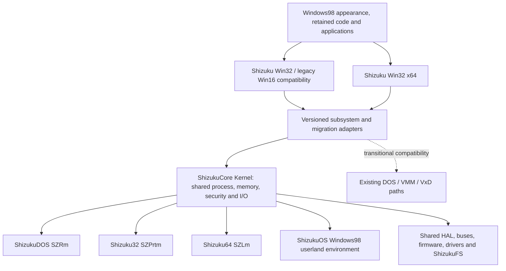

# ShizukuOS mixed-kernel and Windows98-userland transition

Status: accepted user direction, implementation incomplete. Updated 2026-10-03.
This decision supersedes the old requirement that Windows98 VMM remain the
final kernel or scheduling authority. Historical evidence stays unchanged.

## Required end state

The product combines Windows98 appearance and existing Windows98 code with
Shizuku Kernel, Shizuku Win32 and Shizuku Win32 (x64). Preserve the classic and
modern desktop, useful original programs and code, while developing ShizukuCore as the common
kernel beyond MS-DOS/FreeDOS limits. ReactOS and Wine are permitted references.
The migration is incremental, with tested code and interface transitions.

The user's explicit hierarchy is:

```text
ShizukuCore Kernel
├── ShizukuDOS (SZRm)
├── Shizuku32 (SZPrtm)
├── Shizuku64 (SZLm)
└── ShizukuOS (Windows98)
```

ShizukuCore owns common resource/security authority. Its subordinate components
provide the DOS, 32-bit, 64-bit and Windows98-code/userland execution surfaces.
The mode names above are the user's names, not separate unrelated OS kernels.
Existing DOS16/Kernel32/Kernel64 source is a migration starting point; renaming
those directories alone does not implement the common core. Keep mode-specific
CPU entry/exit and ABI adapters under shared ownership contracts.

All fifteen requirements remain: modern drivers; laptop ACPI, power, sensors
and trackpad; session cooperation; separate accounts; elevate; object/file
rights and sandboxing; improved shell and animated wallpaper; settings and
authentication; security; core isolation; multi-agent operation; x64 programs;
an independently specified ShizukuFS with measured NTFS comparisons; both
shell styles; and a working installation ISO. Earlier named modern application
functions, graphics requirements and the bilingual official website remain.



This is the target, not a claim that the pictured connections already work.
Shizuku Kernel32/64 and the user-mode KERNEL32.DLL API are different components.
An x64 API implementation cannot be loaded as an ordinary 32-bit Windows98 DLL.
Win16/NE programs and mixed 16/32-bit libraries require their own loader,
selectors, call/callback thunks, exceptions and shared-state compatibility.

## ADR: ShizukuCore ownership and subordinate execution components

Decision: use existing project components as the starting point for the common
ShizukuCore authority and its subordinate execution components. Define a narrow interface, execute both the current behavior and the new
implementation, then transfer one responsibility after compatibility passes.
Windows98 VMM can remain on a transitional route; it need not remain the final
authority. Old MS-DOS startup is not a prerequisite for a later own-kernel
Windows98-userland execution route.

Alternatives: retaining VMM as permanent authority preserves an old constraint
the user explicitly removed; replacing the whole system in one step loses
working code and contradicts incremental migration. Merely reskinning the
standalone shell does not provide the requested retained-code userland.

Consequences: a transition has more than one implementation, but each live
resource has one declared owner. Never let a legacy frontend and Shizuku driver
both program the same hardware, acknowledge an interrupt twice, or independently
manage the same physical pages. Keep an explicit fallback until each interface
is qualified; a migration failure is not a successful compatibility operation.

## ADR: preserve userland through explicit subsystem contracts

Decision: keep Windows98 user-facing behavior and usable original code while
moving API services behind Shizuku adapters. Reuse the existing Win32/x64 work,
not a new disconnected UI. Version process/thread context, exceptions, handle
translation, memory requests, registry/filesystem access, window events and
driver requests at the boundary. Architecture, pointer width and structure
sizes are explicit; never pass a 64-bit pointer through a 32-bit field.

Token/session identity belongs to the actual service owner and follows each
request. Retained Win98 code must not bypass security by opening an independent
privileged device or inheriting unfiltered kernel handles. Legacy shared-address
space limits remain real until the corresponding implementation is replaced or
confined. Declaring a service native does not establish memory or DMA isolation.

Trade-off: original software can depend on undocumented behavior. Keep behavior
tests for retained software and replace one boundary at a time rather than
claiming that an NT-style API alone executes original Windows98 libraries.

## Code transition and evidence

| Step | Existing starting points | Transfer and required proof |
| --- | --- | --- |
| 1. Establish current executable paths | `shizukudos/kernel32/`, `kernel64/`, `win64/`, existing DOS/VMM bridge | Record which original PE32/NE and project x64 binaries actually load, with real imports, exceptions, window/input work and completion. Missing paths are implementation work. |
| 2. Share services and driver ownership | `kernel64/ntdrv*`, existing memory, scheduler, syscall and hardware services | Move an identified service through an adapter; verify access, ownership, completion, failure and teardown from both userlands. Unsupported requests return errors. |
| 3. Migrate process/object services | Kernel process/thread, handle, account and authentication code | Bind a real userland process to the owning token/session; verify exit, handle revocation, account separation and denied access. Transfer scheduling with executable context/exception support. |
| 4. Complete Win32/Win16 compatibility | API DLLs, PE loader, bridge code; reference upstream loaders/thunks | Load retained Windows98 code with required dependencies. Check DLL initialization, TLS, callbacks, selectors and GUI behavior; retain a route for unconverted contracts. |
| 5. Integrate x64 into the same product | `win64/kernel32/`, `win64/dlls/user32/`, `gdi32/`, `shell32/`, Wine-port glue | Real x64 computation plus input/rendering/file/network work in the shared desktop/session. A separate toolbar or successful imports are insufficient. |
| 6. Install a coherent release | Project installer, UEFI bootstrap, driver packages and publisher | Build the declared route, install, read back, cold boot without ISO and observe drivers/userland. Bind results to shipped source/artifact bytes. |

For each transfer record old/new authority, actual callers, required imports,
data ownership, cancellation, teardown, denied operations and fallback.
Preserve original controls and failures. Security, laptop coverage, modern
driver compatibility and NTFS superiority require their stated scope of proof.

## ReactOS and Wine references

[ReactOS architecture](https://reactos.org/architecture/) separates the Win32
API and shell from the kernel, executive and driver facilities. That separation
informs Shizuku's ownership boundaries; it is not evidence that ReactOS code
or drivers already execute in this project.

[Wine's README](https://raw.githubusercontent.com/wine-mirror/wine/master/README.md)
describes a loader and Windows API implementation over host services. The
[NTDLL loader](https://raw.githubusercontent.com/wine-mirror/wine/master/dlls/ntdll/loader.c)
and [WoW64 syscall code](https://raw.githubusercontent.com/wine-mirror/wine/master/dlls/wow64/syscall.c)
are concrete references for loading and cross-width adaptation. They require
deliberate Shizuku service integration; importing names is not a functioning
subsystem. Pin revisions and retain licenses/provenance for actual code reuse.

## Pre-Beta 01 and truthful completion

The finite Pre-Beta request remains. Select one coherent, implemented route and
disclose its actual kernel/userland composition. A transitional DOS/VMM route
can qualify a limited release if its boot, installation, UEFI target cold boot
and declared driver behavior pass; later own-kernel userland routes may qualify
with equivalent user-visible proof. Neither requires permanent VMM ownership.

This architecture change does not turn the current failed registry-recovery
boot into a pass or remove public-media installation work. A component image
remains a component image. Ship permitted public files/checksums at
`m98.nyase.kr`; user's Windows98 files and installed images stay private.

Documentation and a host compile do not establish this end state. Accept the
full product only after every original requirement is true and verified under
the selected migrated architecture.

## Shell route (2026-10-03 shell07 batch)

The required shell is the retained original Windows98 Explorer on the original
USER/GDI, not SHZDESK or any framebuffer desktop. Source state:

- `shizukudos/install/mkpayload.py`: SHZDESK is off by default and only built
  with the explicit development-only `--desktop`; the manifest records
  `desktop_shell`. The default is the component route until a retained
  Windows98 route is qualified; there is no automatic shell fallback.
- `integration/win98-shell/shell_startup.py`: offline adapter. It refuses a
  disk lacking `shell=Explorer.exe` and the original userland, and writes only
  a candidate copy staging `C:\SHIZUKU\SHZTHEME.EXE` (shell08); WIN.INI,
  SYSTEM.INI and the registry hives stay byte-identical. Never run on a disk
  image yet.
- `apps/shizukuos-appearance/main.c`: Classic works without the provider; the
  ShizukuOS style reports real provider errors. Compiled once only; never run.

Unmet: any Windows98 runtime execution, cold-boot persistence, silent theme
restore launcher, UEFI install of this route, ISO and security qualification.
Tools that require `boot_profile == "desktop"` (build_shizuku_se_iso.py,
test_shizukuos_installer_vm.py, prepare_shizuku_usb.py) need `--desktop` or an
owner decision.

## Shell route (2026-10-03 shell08 batch)

- Global Windows98 palette changes go through the existing
  `ntwddm/win98/theme_selector` (`selector_win98.c` + `selector_core.c`):
  USER32 `SetSysColors` with readback, a transactional HKCU profile and a Run
  restore. The app-local M98THEME provider alone does not style Explorer.
- Startup is `C:\SHIZUKU\SHZTHEME.EXE /restore`, which exits without changes
  when no profile was saved. WIN.INI `run=` is not used because argument
  passing there is unproven; the selector writes its own HKCU Run value after
  the first explicit selection. Seeding that Run value offline before any
  selection needs a registry writer that does not exist yet. Choosing a first palette is
  a separate explicit user action in the appearance app or the selector window;
  nothing opens a popup at logon.
- `ntwddm/win98/theme_global_startup/launcher.c` is a test observer, not the
  product launcher.
- Status: source and selective build only. Original Windows98 runtime,
  installation security and ISO qualification remain unverified. Executable
  hashes are artifact identity, not runtime proof. See
  `build/claude-shizuku-reports/shell08-*.md` for per-worker results.
